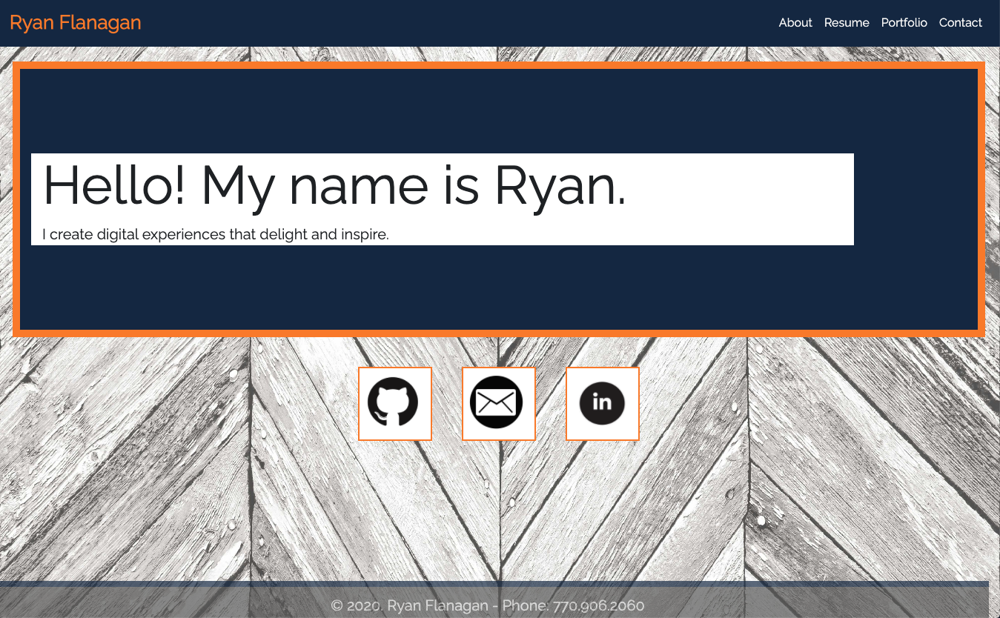

# rfportfolionew

## Description
The portfolio site contained in this repository has been created from the skills I've learned thus far within the Georgia Tech Coding Bootcamp - Fall 2020 cohort.

This site contains 4 pages to include:

- [Index Page](https://rflanagan82.github.io/rfportfolionew/)
- [About Page](https://rflanagan82.github.io/rfportfolionew/about.html)
- [Portfolio](https://rflanagan82.github.io/rfportfolionew/portfolio.html)
- [Contact](https://rflanagan82.github.io/rfportfolionew/contact.html)

The site also contains a link to my latest resume as a PDF file.

## Visit My Portfolio
[Click here to access my portfolio](https://rflanagan82.github.io/rfportfolionew/)

## Usage
All of the files necessary to run this website are available in [this repository](https://github.com/RFlanagan82/rfportfolionew).

## Badge

## Updates
This time around I have incorporated flexbox elements to see how they would work within my new portfolio.

My phone number has also been moved to the footer bar.

I also plan on incorporating Mongoose and building a database to hold those who complete my contact me form in the near future.

## License

MIT License

Copyright (c) [2020] [Ryan Flanagan]

Permission is hereby granted, free of charge, to any person obtaining a copy
of this software and associated documentation files (the "Software"), to deal
in the Software without restriction, including without limitation the rights
to use, copy, modify, merge, publish, distribute, sublicense, and/or sell
copies of the Software, and to permit persons to whom the Software is
furnished to do so, subject to the following conditions:

The above copyright notice and this permission notice shall be included in all
copies or substantial portions of the Software.

THE SOFTWARE IS PROVIDED "AS IS", WITHOUT WARRANTY OF ANY KIND, EXPRESS OR
IMPLIED, INCLUDING BUT NOT LIMITED TO THE WARRANTIES OF MERCHANTABILITY,
FITNESS FOR A PARTICULAR PURPOSE AND NONINFRINGEMENT. IN NO EVENT SHALL THE
AUTHORS OR COPYRIGHT HOLDERS BE LIABLE FOR ANY CLAIM, DAMAGES OR OTHER
LIABILITY, WHETHER IN AN ACTION OF CONTRACT, TORT OR OTHERWISE, ARISING FROM,
OUT OF OR IN CONNECTION WITH THE SOFTWARE OR THE USE OR OTHER DEALINGS IN THE
SOFTWARE.
